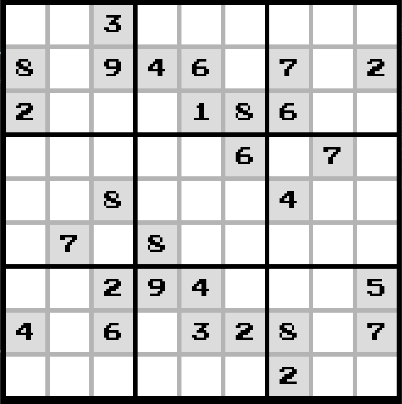

# Sudoku Solver

## About

A simple sudoku solver and generator created by Nishant Dash. The solver is created in python and solve using a recursive depth first search. It is displayed using pygame.

---

## About Sudoku

Sudoku is a game made of a nine by nine grid. The goal of the game is to fill the grid in such a way that every row, column, and 3x3 square contains every digit from 1 to 9. Each grid starts with some constants and the player is tasked with filling the rest of the grid. An example sudoku board is above.

### Solving Sudoku

The `Sudoku` class in the [sudoku.py](./sudoku.py) file contains a method to solve the board. It solves using a depth first search. It looks from right to left, top to bottom, for the first empty cell and fills it with the lowest valid value 1-9 and repeats. If the solver cannot find a valid value for a cell then it backtracks to the previous empty cell, incrementing it to the next valid value. The solver continues the cycle of filling cells and backtracking until either the board is filled and the solve function returns `True` or no solution is found and it returns `False`.

### Generating Sudoku

Generating sudoku boards is a hard problem and is still being researched. A simple method was implemented here. the `generate_board` function clears the board and fills the diagonal of the board with a random valid value. Then it uses the `solve` function to fill the rest of the board. Finally it removes random cells until there are `num_cells` left. The result is a randomly generated sudoku board.

One problem with this method is that it does not create boards of equal difficulty.

---

## The Sudoku GUI

The GUI was created using pygame. Clicking a cell will highlight it and allow the user to input a number. If a number is not valid, the cell will be highlighted red.

Multiple buttons trigger different functions:
* Pressing enter solves the board
* Pressing backspace or delete while selecting a cell will remove the number in the cell
    * In constant edit mode you can delete constants
* Pressing c will clear the board
    * Clears player numbers and penciling normally
    * Will only clear cells with penciling if in pencil mode
    * Will clear everything if in constant mode
* Pressing g will generate a new board
* Pressing i will pencil the board with all possible values
* Pressing p will turn on pencil edit mode
* Pressing o will turn on constant edit mode